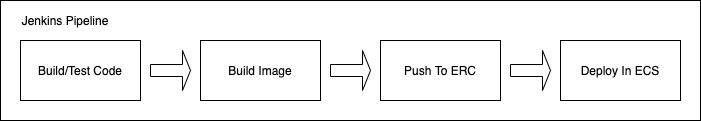

# BITCOIN ON ECS



---

The purpose is to create containerized version of Bitcoin from https://bitcoincore.org/bin/ binaries and build a Jenkins pipeline to deploy the image to Amazon ECS. Security scanning of the build image is done with Grype.


---


_Jargon for the uninitiated:_

_Bitcoin_
Bitcoin is a network consisting of many members, called nodes, who follow the Bitcoin protocol and enforce its rules.

Bitcoin is also the software that each node runs in order to participate in the network. The main version of this software is called Bitcoin Core, and it powers almost all of the nodes on the Bitcoin network, allowing them to enforce the same ruleset and achieve consensus. You can check out the Bitcoin Core website at bitcoin.org.

_Bitcoin Core_
Bitcoin Core is simply open source code. This means that anyone is able to view, comment, or propose changes to the code. Furthermore, anyone can change their copy of the code as they wish. You can examine the code on GitHub.

_Grype_
Most enterprises focus on runtime container security. However, sometimes the containers themselves have a vulnerability at build time that goes undetected to the untrained eye.
Containers use layers, and most containers are built from third-party base images that are available on Docker Hub. So, even if your code is secure and robust, you might end up deploying something in production that you shouldn’t have deployed because of a vulnerable base image. Anchore Grype is a container vulnerability scanner that helps you scan your container images for vulnerability using a simple CLI that is easy to install and run. The best part is that you can use this tool within your Jenkins CI/CD pipelines and fail builds that cross a certain vulnerability threshold.

_Jenkinsfile_
A Jenkinsfile is a text file that contains the definition of a Jenkins Pipeline and is checked into source control.

_Dockerfile_
A Dockerfile is a text document that contains all the commands a user could call on the command line to assemble an image.

---

### Features

- Dockerfile builds the container image for Bitcoin from https://bitcoincore.org/bin/ binaries
- A checksum is done to check integrity of the binary.
- Grype is used to security check the build image and aborts build if vulnerabilities are detected.
- Jenkinsfile does automates the build > verify > deployment stages.

---

###  Usage

_Prerequisites:_
_Jenkins Server, Docker, AWS account credentials._

---

#.......................................................#
# Docker Build & Local Execution
#-------------------------------------------------------#

* Local Build & Push to DockerHub

```bash
docker build -t servergurus/bitcoin:0.21.0
docker push servergurus/bitcoin:0.21.0
```


By default, `bitcoind` will run as user `bitcoin` for security reasons and with its default data dir (`~/.bitcoin`). If you'd like to customize where `bitcoin-core` stores its data, you must use the `BITCOIN_DATA` environment variable. The directory will be automatically created with the correct permissions for the `bitcoin` user and `bitcoin-core` automatically configured to use it.

```sh
❯ docker run --env BITCOIN_DATA=/var/lib/bitcoin-core --rm -it servergurus/bitcoin:0.21.0 \
  -printtoconsole \
  -regtest=1
```

You can also mount a directory in a volume under `/home/bitcoin/.bitcoin` in case you want to access it on the host:

```sh
❯ docker run -v ${PWD}/data:/home/bitcoin/.bitcoin -it --rm servergurus/bitcoin:0.21.0 \
  -printtoconsole \
  -regtest=1
```

You can optionally create a service using `docker-compose`:

```yml
bitcoin-core:
  image: servergurus/bitcoin:0.21.0
  command:
    -printtoconsole
    -regtest=1
```


#.......................................................#
# Jenkins Pipeline & Grype Security Checks
#-------------------------------------------------------#
##### Step 1: Jenkins Setup

We're going to run jenkins in a container to make this fairly self-contained and easily disposable.  This command will run jenkins and bind to the host's docker sock (if you don't know what that means, don't worry about it, it's not important).

`$ docker run -u root -d --name jenkins --rm -p 8080:8080 -p 50000:50000 -v /var/run/docker.sock:/var/run/docker.sock -v /tmp/jenkins-data:/var/jenkins_home jenkinsci/blueocean
`

and we'll need to install jq in the jenkins container:

`$ docker exec jenkins apk add jq`

Once Jenkins is up and running, we have just a few things to configure:
- Get the initial password (`$ docker logs jenkins`)
- log in on port 8080
- Unlock Jenkins using the password from the logs
- Select “Install Selected Plugins” and create an admin user
- Create a credential so we can push images into Docker Hub:
	- go to manage jenkins -> manage credentials
	- click “global” and “add credentials”
	- Use your Docker Hub username and password (get an access token from Docker Hub if you are using multifactor authentication), and set the ID of the credential to “Docker Hub”.

##### Step 2: Get Grype
We can download the syft and grype binaries directly into our running container:

```
$ docker exec --user=root jenkins bash -c 'curl -sSfL https://raw.githubusercontent.com/anchore/syft/main/install.sh | sh -s -- -b /usr/local/bin'
$ docker exec --user=root jenkins bash -c 'curl -sSfL https://raw.githubusercontent.com/anchore/grype/main/install.sh | sh -s -- -b /usr/local/bin'
```

NB: these are only installed into the running container, not the image, so if you recreate the jenkins container, you'll need to re-download these.

##### Step 3: Check for CVEs with Grype

- Fork this repo
- In the `Jenkinsfile`, change this line, replace your Docker ID and repository`
- From the jenkins main page, select “New Item”
- Name it
- Choose “pipeline” and click “OK”
- On the configuration page, scroll down to “Pipeline”
- For “Definition,” select “Pipeline script from SCM”
- For “SCM,” select “git”
- For “Repository URL,” paste in the URL of your forked github repo
	e.g. https://github.com/prasanjit-/btc-on-ecs (use your github username)
- Click “Save”
- You’ll now be at the top-level project page.  Click “Build Now”


Jenkins will check out the repo and build an image using the provided Dockerfile.  This image will be a simple copy of dvwa (dang vulnerable web app), which is an example app that is full of known vulnerabilities.  Once the image is built, Jenkins will call grype and then grep through the output to search for High and Critical issues.  This should cause the pipeline to fail at the “Analyze with grype” stage.

You can check the console output for the build if you want to see where the failure occurs.

##### Step 4: Push to DockerHub repository & Deploy to ECS


The next two stages will push the build docker image to DockerHub repository (or ECR if that is used) & deployed to ECS. Once done, verify the deployed task on ECS Cluster.


---


<p align='center'>

  <a href="https://www.linkedin.com/in/prasanjit-singh/">
    
  </a>&nbsp;&nbsp;
  <a href="https://youtube.com/binpipe">
            
  </a>&nbsp;&nbsp;

</p>
